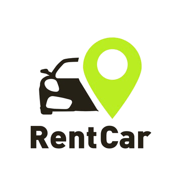

# Rent a Car

**Rent a Car** je moderna veb-aplikacija za iznajmljivanje automobila, zasnovana na **React** (front-end), **Laravel** (back-end) i **MySQL** (baza podataka). Cilj sistema je da neulogovanim posetiocima omogući pregled ponude, registraciju i prijavu, dok registrovani korisnici mogu da rezervišu automobile, upravljaju svojim rentiranjima i ostavljaju recenzije. Administratorima su dostupni dodatni alati za nadgledanje i upravljanje korisnicima, rentiranjima i detaljnim statističkim izveštajima.



Neulogovani korisnici mogu da pregledaju početnu stranu sajta, listu svih dostupnih automobila i postojeće recenzije. Imaju opciju da se registruju unosom imena, e-maila, lozinke i otpremanjem lične karte i vozačke dozvole. Nakon registracije i prijave, pristupaju svom korisničkom panelu na kojem se meri njihov status i vodi računa o bezbednosti.

Regularni (ulogovani) korisnici dobijaju personalizovan dashboard sa pozdravnom porukom i linkovima ka sopstvenim rentiranjima i ponudi automobila. U sekciji _Moje rente_ mogu da pregledaju, ažuriraju datume ili otkažu rezervacije, dok u okviru liste automobila pretražuju, filtriraju po vrsti goriva, sortiraju po ceni i potvrđuju nove rentiranja kroz modalni dijalog. Takođe, mogu da kreiraju, izmenjuju ili brišu recenzije, ocenjujući vozila zvezdicama i komentarišući iskustvo.

Administratorima je dostupan poseban **Administratorski panel** gde, pored pregleda korisnika i svih rentiranja, mogu da generišu statističke izveštaje: mesečne trendove iznajmljivanja (linijski grafikon) i broj rentiranja po modelu automobila (bar-grafikon). Uz to, imaju mogućnost da uređuju podatke korisnika (ime, e-mail, uloga), brišu rentiranja ili recenzije, i prate dodatne detalje kroz interaktivne grafikone i GIF animacije iz Giphy API-ja.

---

## 📦 Tech Stack

- **Front-end**: React, React Router, Recharts, Fetch API  
- **Back-end**: Laravel 10, Sanctum for API authentication  
- **Database**: MySQL  
- **Styling**: vanilla CSS, CSS variables for theming  

Instalacija i pokretanje
---------------------------

1. Klonirajte repozitorijum:
```bash
    git clone https://github.com/elab-development/internet-tehnologije-2024-projekat-rentacar_20210476_20210328.git
```
2. Pokrenite backend:
```bash
   cd rent_a_car
   composer install
   php artisan migrate:fresh --seed
   php artisan serve
```
    
3. Pokrenite frontend:
```bash
   cd rent_a_car_front
   npm install
   npm start
```
    
4.  Frontend pokrenut na: [http://localhost:3000](http://localhost:3000) Backend API pokrenut na: [http://127.0.0.1:8000/api](http://127.0.0.1:8000/api)